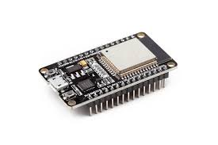
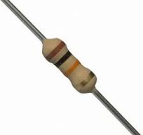
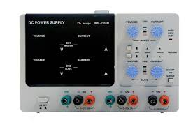
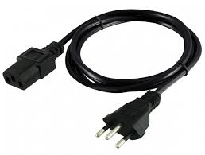
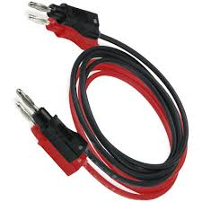
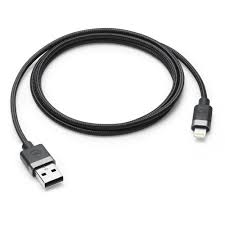
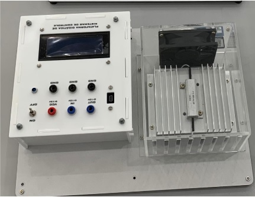
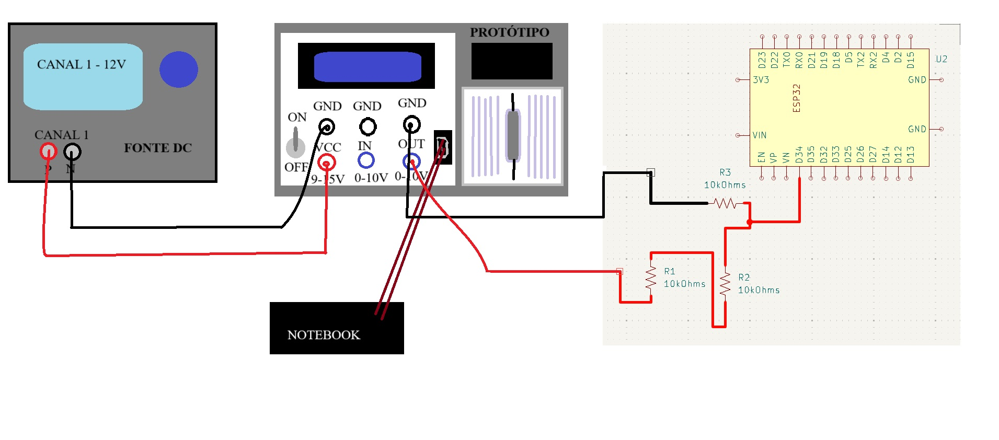
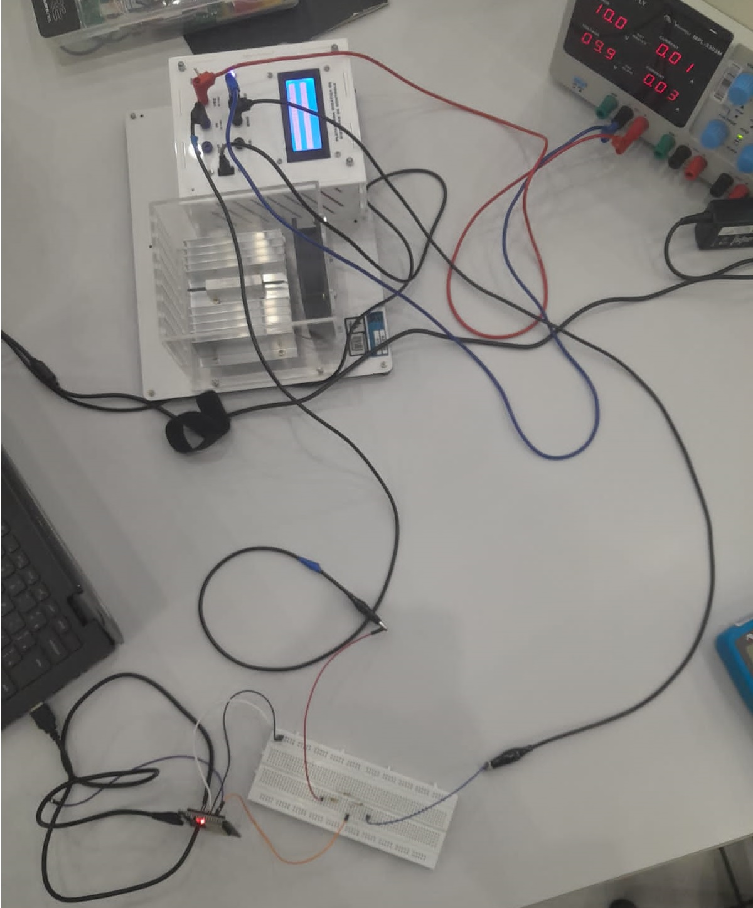

# Sistema IoT para Monitoramento Térmico em Estufas de Secagem de Motores Elétricos


## Objetivo:  
  
Desenvolver um sistema de monitoramento baseado em Internet das Coisas (IoT) para o 
controle de estufa de secagem de motores elétricos. Esse sistema deverá obter de forma 
precisa os dados de temperatura em tempo real, mediante ajustes dinâmicos dos parâmetros  
de controle, garantido a eficiência operacional.  Esse sistema utilizará a plataforma de back
end FIWARE para processamento e armazenamento de informações contextuais, visando a 
otimização do processo de fabricação. A solução permitirá a regulação precisa da 
temperatura, monitoramento remoto em tempo real e aprimoramento da eficiência 
operacional, garantindo a produção de motores elétricos de alta qualidade e uniformidade 
em todas as unidades da empresa. O sistema será complementado por uma plataforma web 
desenvolvida em ASP.NET MVC, que dará suporte a cadastros e fornecerá visualização de 
dados em consultas e dashboards. 

## Descrição da Proposta:   
  
Em um contexto de produção global, uma empresa de motores elétricos enfrenta desafios 
significativos relacionados ao monitoramento em tempo real da temperatura nas estufas 
utilizadas para a secagem dos enrolamentos dos motores. Esse processo é crucial para 
assegurar a qualidade e durabilidade dos produtos, impactando diretamente a eficiência e 
a confiabilidade dos motores em aplicações industriais, comerciais e residenciais. 
A proposta deste projeto é criar um sistema de monitoramento IoT para um protótipo em 
escala reduzida de uma estufa de secagem. Este protótipo contará com uma resistência de 
aquecimento e sensores de temperatura, funcionando como um modelo para o 
desenvolvimento e teste de um sistema de controle e monitoramento térmico baseado em 
dispositivos IoT. Os testes serão realizados com base em condições reais de produção, 
proporcionando a oportunidade de desenvolver um sistema robusto e escalável antes de 
sua aplicação em larga escala em unidades industriais ao redor do mundo. 
O protótipo consiste em uma resistência de 6 Ohms com potência de 50W, utilizada para o 
aquecimento, acoplada a um dissipador de calor e a um sensor de temperatura LM35.

## Hardware

### Componentes
| **Componente**         | **Função**                                                                                                                | **Imagem** |
|-------------------------|---------------------------------------------------------------------------------------------------------------------------|------------|
| **Protoboard**          | Dispositivo utilizado para construir circuitos eletrônicos temporários sem solda, facilitando a experimentação.          |  |
| **ESP32**               | Conectividade e comunicação com a plataforma FIWARE, operando de 0V a 3,3V e suportando Wi-Fi e Bluetooth. LED embutido. |       |
| **10KΩ Resistor**       | Protege contra correntes excessivas e divide a tensão, garantindo leituras precisas de sinais analógicos.                |    |
| **Jumper Wires**        | Conecta fisicamente os componentes eletrônicos do sistema.                                                               |  |
| **Fonte DC**            | Fornece tensão contínua (DC) estável para alimentar circuitos eletrônicos.                                               |    |
| **Cabo de Força**       | Transmite energia elétrica de uma fonte para dispositivos eletrônicos ou equipamentos.                                   |  |
| **Cabos Banana**        | Conexões seguras em equipamentos eletrônicos, com conectores tipo banana.                                                |  |
| **Cabo USB**            | Permite comunicação e alimentação de dispositivos eletrônicos.                                                           |    |
| **Protótipo**           | Simula o funcionamento de uma estufa.                                                                                    |   |
| **Notebook**            | Equipamento utilizado para desenvolvimento e monitoramento do sistema.                                                   |    |

### Conexões
| **Componente** | **Conexão**                                                              |
|----------------|----------------------------------------------------------|
| **ESP32**      | Porta - D34 -> Divisor de Tensão conectado ao protótipo                  |
| **Fonte DC**   | Positivo canal 1 -> VCC do protótipo <br> Negativo canal 1 -> GND protótipo |
| **Protótipo**  | OUT -> Entrada D34 do ESP32, com divisor de tensão com resistores <br> GND -> Saída do Resistor <br> GND -> Negativo da Fonte <br> VCC -> Positivo da Fonte <br> USB -> Notebook |

### Diagrama Elétrico
.
### Projeto Físico
.

## Software
### FIWARE
FIWARE é uma plataforma aberta que oferece ferramentas e APIs para o desenvolvimento de soluções inteligentes, facilitando a interoperabilidade entre sistemas, dispositivos IoT e aplicações. Seu principal componente, o Orion Context Broker, gerencia dados contextuais em tempo real, permitindo que dispositivos compartilhem informações. Neste caso, dados de temperatura são enviados ao FIWARE para tomada de decisões automatizadas. Os componentes da plataforma, conhecidos como Generic Enablers, são implantados via Docker, garantindo escalabilidade e portabilidade. APIs RESTful asseguram a comunicação entre os sistemas, enquanto o broker MQTT integra os dados do ESP32 ao FIWARE para processamento e análise em tempo real.

#### Diagrama em Camadas da Aplicação
.

### Código do ESP32
#### Dependências
Este projeto necessita das seguintes bibliotecas para funcionar:<br>
WiFi.h: Biblioteca para conexão Wi-Fi.<br>
PubSubClient.h: Biblioteca MQTT para Arduino.<br>
```cpp
#include <WiFi.h>
#include <PubSubClient.h>
```

#### Principais Parâmetros Configuráveis
O código permite personalizar várias informações para adaptá-lo a diferentes redes e plataformas. Aqui estão as principais variáveis configuráveis:
```cpp
// Configurações de Wi-Fi
const char* default_SSID = "POCO F5";       // Nome da rede Wi-Fi
const char* default_PASSWORD = "kanx5025"; // Senha da rede Wi-Fi

// Configurações do Broker MQTT
const char* default_BROKER_MQTT = "4.228.64.5"; // Endereço IP do broker
const int default_BROKER_PORT = 1883;          // Porta MQTT

// Configurações dos Tópicos MQTT
const String lamp = "03y"; 
const String mensagem_TOPICO_SUBSCRIBE = "/TEF/lamp" + lamp + "/cmd";  // Comandos
const String mensagem_TOPICO_PUBLISH_1 = "/TEF/lamp" + lamp + "/attrs"; // Estado do LED
const String mensagem_TOPICO_PUBLISH_2 = "/TEF/lamp" + lamp + "/attrs/t"; // Luminosidade

// GPIO do LED
const int default_D4 = 2; // Pino do LED onboard
```
#### Tópicos MQTT Utilizados
```/TEF/lamp03y/cmd```: Recebe comandos para ligar ou desligar o LED.<br>
Mensagem de Ligar: ```"lamp03y@on|"``` .<br>
Mensagem de Desligar: ```"lamp03y@off|"``` .<br>
```/TEF/lamp03y/attrs```: Publica o estado do LED (```"s|on"```  ou ```"s|off"``` ).<br>
```/TEF/lamp03y/attrs/t```: Publica a luminosidade lida do sensor.<br>

#### Configuração do Wi-Fi e Broker MQTT

O código tenta se conectar ao Wi-Fi e reconecta automaticamente caso a conexão caia. Após estabelecer a conexão, o ESP32 se conecta ao broker MQTT e configura tópicos de envio e escuta.
```cpp
void initWiFi() {
    Serial.println("Conectando ao Wi-Fi...");
    WiFi.begin(SSID, PASSWORD);
    while (WiFi.status() != WL_CONNECTED) {
        delay(500);
        Serial.print(".");
    }
    Serial.println("\nWi-Fi conectado!");
    Serial.print("IP: ");
    Serial.println(WiFi.localIP());
}

void initMQTT() {
    MQTT.setServer(BROKER_MQTT, BROKER_PORT);
    MQTT.setCallback(mqtt_callback);
    reconnectMQTT();
}
```
#### Reconexão Automática
Caso o ESP32 perca a conexão com o Wi-Fi ou o broker MQTT, ele tenta reconectar automaticamente.
```cpp
void VerificaConexoesWiFIEMQTT() {
    if (WiFi.status() != WL_CONNECTED) {
        reconectWiFi();
    }
    if (!MQTT.connected()) {
        reconnectMQTT();
    }
}
```

#### Controle do LED Onboard
As mensagens MQTT enviadas ao tópico de comando controlam o estado do LED onboard. O ESP32 responde ao comando ligando ou desligando o LED.
```cpp
void mqtt_callback(char* topic, byte* payload, unsigned int length) {
    String msg;
    for (int i = 0; i < length; i++) {
        msg += (char)payload[i];
    }
    if (msg == "lamp03y@on|") {
        digitalWrite(D4, HIGH);
        EstadoSaida = '1';
    } else if (msg == "lamp03y@off|") {
        digitalWrite(D4, LOW);
        EstadoSaida = '0';
    }
}
```

#### Leitura e Publicação de Temperatura
O código realiza uma leitura analógica do GPIO 34, simula valores de temperatura, e os publica no broker MQTT.
```cpp
void handleLuminosity() {
    const int potPin = 34;
    int sensorValue = analogRead(potPin);
    int luminosidade = map(sensorValue, 0, 4095, 0, 100);
    String mensagem = String(luminosidade);
    MQTT.publish(TOPICO_PUBLISH_2, mensagem.c_str());
    Serial.println("Luminosidade publicada: " + mensagem);
}
```
### Structured Query Language
#### Diagrama Conceitual


#### Diagrama Lógico


#### Criação do Banco de Dados
```sql
create database Termo_Light
go

use [Termo_Light]
go
```
#### Tabela ```empresa```
Armazena informações sobre as empresas, como nome, logo e sede.
```sql
create table empresa(
	id int identity(1,1) primary key not null,
	nome varchar(500) not null,
	logo varbinary(max) null,
	sede varchar(500) not null
)
go

insert into Empresa( nome, logo, sede) values ('Termo-Light', null, 'SP')
go
```
#### Tabela ```sensor```
Armazena informações sobre os sensores, com referência à empresa à qual pertencem.
```sql
create table sensor(
	id int identity(1,1) primary key not null,
	descricao varchar(500) null,
	fk_empresa_id int null,
	foreign key (fk_empresa_id) references Empresa(id) 
	on delete set null
)
go
```
#### Tabela ```acesso```
Armazena informações de acesso, incluindo nome de usuário, login, senha e a associação com a empresa.
```sql
create table acesso(
	id int identity(1,1) primary key not null,
	Nome_Usuario varchar(500) not null,
	login_Usuario varchar(500) not null,
	Senha varchar(500) not null,
	fk_empresa_id int not null,
	foreign key (fk_empresa_id) references Empresa(id)
	on delete cascade
)
go

insert into acesso (Nome_Usuario, login_usuario, senha, fk_empresa_id) values('SA','SA','123456',1)
go
```
#### Tabela ```funcionario```
Armazena informações sobre os funcionários, como nome, cargo, foto e data de contratação.
```sql
create table funcionario(
	id int identity(1,1) primary key not null,
	nome varchar(500) not null,
	cargo varchar(500) not null,
	foto varbinary(max) null,
	dataContratacao datetime not null
)
go
```
#### Tabela ```manutencao```
Armazena informações sobre a manutenção de sensores, incluindo a data, o funcionário responsável, o estado da manutenção, e referências aos sensores e funcionários envolvidos.
```sql
create table manutencao(
	id int identity(1,1) primary key not null,
	data_hora datetime not null,
	fk_sensor_id int not null,
	fk_funcionario_id int not null,
	estado int not null,
	foreign key ( fk_sensor_id) references Sensor(id)
		on delete cascade,
	foreign key (fk_funcionario_id) references Funcionario(id)
		on delete cascade
)
go
```

#### ```sp_delete_generic```
Essa stored procedure é usada para excluir uma linha de uma tabela genérica, com base no ID da linha e o nome da tabela. Ela monta dinamicamente uma instrução SQL para realizar a exclusão.
```sql
create or alter procedure sp_delete_generic(
	@id int,
	@tabela varchar(max)
)
as
begin
	declare @sql varchar (max)
	set @sql = ' delete ' + @tabela + ' where id = ' + cast(@id as varchar(max))
	exec (@sql)
end
```
#### ```sp_consulta_generic```
Retorna todos os dados de uma tabela específica para um determinado ID. A tabela e o ID são passados como parâmetros. Similar à ```sp_delete_generic```, a consulta é construída dinamicamente.
```sql
create or alter procedure sp_consulta_generic(
	@id int,
	@tabela varchar(max)
)
as
begin
	declare @sql varchar(max)
	set @sql = 'select * from ' + @tabela + ' where id = ' + CAST(@id as varchar(max))
	exec (@sql)
end
```
#### ```sp_listagem_generic```
Esta procedure retorna todas as linhas de uma tabela específica e permite a ordenação dos resultados através do parâmetro @ordem.
```sql
create or alter procedure sp_listagem_generic(
	@tabela varchar(max),
	@ordem varchar(max)
)
as
begin
	declare @sql varchar(max)
	set @sql = 'select * from ' + @tabela + ' order by ' + @ordem
	exec (@sql)
end
```
#### ```sp_insert_empresa```
Usada para inserir uma nova empresa na tabela Empresa, incluindo nome, logo e sede.
```sql
create or alter procedure sp_insert_empresa(
	@nome varchar(500),
	@logo varbinary(max),
	@sede varchar(500)
)
as
begin
	insert into Empresa (nome, logo, sede) values (@nome, @logo, @sede);
end
```

#### ```sp_update_empresa```
Atualiza os dados de uma empresa existente, identificada por ID.
```sql
create or alter procedure sp_update_empresa(
	@id int,
	@nome varchar(500),
	@logo varbinary(max),
	@sede varchar(500)
)
as
begin
	update Empresa set nome = @nome, logo = @logo, sede = @sede
	where id = @id
end
```
#### ```sp_busca_id_empresa```
Busca o ID de uma empresa pelo nome.
```sql
create or alter procedure sp_busca_id_empresa(
	@nome varchar(500)
)
as
begin
	select id from Empresa where nome = @nome
end
```
#### ```sp_insert_sensor```
Insere um novo sensor na tabela Sensor, associando-o a uma empresa via fk_empresa_id.
```sql
create or alter procedure sp_insert_sensor(
	@descricao varchar(500),
	@fk_empresa_id int
)
as
begin
	insert into Sensor(descricao, fk_empresa_id) values (@descricao, @fk_empresa_id)
end
```
#### ```sp_update_sensor```
Atualiza os dados de um sensor específico, identificado por ID.
```sql
create or alter procedure sp_update_sensor(
	@id int,
	@descricao varchar(500),
	@fk_empresa_id int
)
as
begin
	update Sensor set descricao = @descricao, fk_empresa_id =@fk_empresa_id where id = @id
end
```
#### ```sp_verificar_sensor```
Verifica se existe um sensor com a descrição fornecida. Retorna a contagem de registros.
```sql
create or alter procedure sp_verificar_sensor(
	@descricao varchar(max)
)
as
begin
	select COUNT(descricao) as cont from sensor where descricao = @descricao
end
```
#### ```sp_avancado_sensor```
Permite uma busca avançada de sensores, filtrando por descricao e empresa, com um parâmetro de tipo (```@tipo```).
```sql
create or alter procedure sp_avancado_sensor(
	@descricao varchar(max),
	@empresa varchar(max),
	@tipo bit
)
as
begin
	declare @likeDescricao varchar(max)
	set @likeDescricao = '%' + @descricao + '%'
	declare @likeEmpresa varchar(max)
	set @likeEmpresa = '%' + @empresa + '%'

	select s.id, descricao, fk_empresa_id 
	from sensor as s
	inner join empresa as e
	on e.id = s.fk_empresa_id
	where s.descricao like @likeDescricao and
	( (@tipo = 0 and e.nome like @likeDescricao) or (@tipo = 1 and e.nome = @empresa))
end
```
#### ```sp_insert_acesso```
Insere um novo acesso de usuário na tabela ```Acesso```.
```sql
create or alter procedure sp_insert_acesso(
	@senha varchar(500),
	@Nome_Usuario varchar(500),
	@login_Usuario varchar(500),
	@fk_empresa_id int
)
as
begin
	insert into Acesso(Nome_Usuario, senha, fk_empresa_id) values (@Nome_Usuario, @senha, @fk_empresa_id)
end
```
#### ```sp_login_acesso```
Recupera todos os acessos de uma empresa, utilizado para fazer login.
```sql
create or alter procedure sp_login_acesso(
	@id_empresa int
)
as
begin
	select * 
	from Acesso as a 
	inner join Empresa as e on e.id = a.fk_empresa_id 
	where e.id = @id_empresa
end
```
#### ```sp_update_acesso```
Atualiza os dados de acesso de um usuário, como nome, login, senha e a empresa associada.
```sql
create or alter procedure sp_update_acesso(
	@id int,
	@Nome_Usuario varchar(500),
	@login_Usuario varchar(500),
	@senha varchar(500),
	@idEmpresa int
)
as
begin
	update acesso set Nome_Usuario = @Nome_Usuario, fk_empresa_id = @idEmpresa, senha = @senha, @login_Usuario = @login_Usuario where id = @id
end
```
#### ```sp_insert_funcionario```
Insere um novo funcionário na tabela ```Funcionario```.
```sql
create or alter procedure sp_insert_funcionario(
	@nome varchar(500),
	@cargo varchar(500),
	@foto varbinary(max),
	@dataContratacao datetime
)
as
begin
	insert into Funcionario (nome, Cargo, Foto, dataContratacao) values (@nome, @cargo, @foto, @dataContratacao)
end
```
#### ```sp_update_funcionario```
Atualiza os dados de um funcionário, identificando-o por ID.
```sql
create or alter procedure sp_update_funcionario(
	@id int,
	@nome varchar(500),
	@cargo varchar(500),
	@foto varbinary(max),
	@dataContratacao datetime
)
as
begin
	update Funcionario set nome = @nome, cargo = @cargo, Foto = @foto, dataContratacao = @dataContratacao where id = @id 
end
```
#### ```sp_insert_manutencao```
Insere um novo registro de manutenção, associando a data, o sensor e o funcionário.
```sql
create or alter procedure sp_insert_manutencao(
	@data_hora datetime,
	@fk_sensor_id int,
	@fk_funcionario_id int,
	@estado int
)
as
begin
	insert into Manutencao(data_hora, fk_sensor_id, fk_funcionario_id, estado) 
	values (@data_hora, @fk_sensor_id, @fk_funcionario_id, @estado)
end
```
#### ```sp_update_manutencao```
Atualiza o registro de manutenção existente com base no ID.
```sql
create or alter procedure sp_update_manutencao(
	@id int,
	@data_hora datetime,
	@fk_sensor_id int,
	@fk_funcionario_id int,
	@estado int
)
as
begin
	update manutencao set data_hora = @data_hora, fk_funcionario_id = @fk_funcionario_id, fk_sensor_id = @fk_sensor_id, estado = @estado where id = @id
end
```
#### ```sp_avancado_manutencao```
Executa uma busca avançada nos registros de manutenção, permitindo filtrar por data, funcionário, empresa, sensor e estado.
```sql
create or alter procedure sp_avancado_manutencao(
	@data_hora_inicial datetime,
	@data_hora_final datetime,
	@funcionario varchar(max),
	@empresa varchar(max),
	@sensor varchar(max),
	@estado int
)
as
begin
	set @funcionario = '%' + @funcionario + '%'
	set @empresa = '%' + @empresa + '%'
	set @sensor = '%' + @sensor + '%'

	select m.id, m.fk_funcionario_id, m.fk_sensor_id, m.data_hora, m.estado
	from manutencao as m
	inner join sensor as s on s.id = m.fk_sensor_id
	inner join funcionario as f on f.id = m.fk_funcionario_id
	inner join empresa as e on e.id = s.fk_empresa_id
	where m.data_hora >= @data_hora_inicial and m.data_hora <= @data_hora_final
	and e.nome like @empresa and s.descricao like @sensor and f.nome like @funcionario
	and ((estado = @estado and @estado !=4) or (@estado = 4))
end
```
### Site
#### *Models*
Este projeto define uma série de modelos para a aplicação SitePBL. Esses modelos representam as entidades do sistema e são organizados para facilitar a integração
e o uso nas camadas de apresentação e controle.<br>

1. **PadrãoViewModel**: Classe abstrata base para outras ViewModels. <br>
* Propriedade: ```int? id``` Identificador genérico.<br>

2. **AcessoViewModel**: Representa as credenciais de acesso de usuários ao sistema. <br>
* Herança: PadraoViewModel <br>
* Propriedades: <br>
```string senha``` Senha do usuário <br>
```int empresaId``` Identificador da empresa associada <br>
```string nomeEmpresa``` Nome da empresa associada <br>
```string loginUsuario``` Login do usuário <br>
```string nomeUsuario``` Nome do usuário <br>

3. **ManutencaoViewModel**: Armazena informações sobre manutenções.
* Herança: PadraoViewModel <br>
* Propriedades: <br>
```DateTime data_hora``` Data e hora da manutenção. <br>
```int idSensor``` Identificador do sensor relacionado.<br>
```string? descricaoSensor``` Descrição do sensor.<br>
```int idFuncionario``` Identificador do funcionário responsável.<br>
```string? nomeFuncionario``` Nome do funcionario responsável.<br>
```int estadoId``` Estado da manutenção (feito, em andamento, etc).<br>
```string? estadoNome```Nome do estado.<br>
```string? nomeEmpresa``` Nome da empresa associada.<br>

4. **SensorViewModel**: Representa informações sobre os sensores do sistema.<br>
* Herança: PadraoViewModel <br>
* Propriedades: <br>
```string descricao``` Descrição ou identificador do sensor no Fiware.<br>
```int empresaId``` Identificador da empresa associada.<br>
```string? empresaNome``` Nome da empresa associada.<br>

5. **FotoPadraoViewModel**: Classe abstrata que adiciona suporte para manipulação de imagens.<br>
* Herança: PadraoViewModel <br>
* Propriedades: <br>
```IFormFile? imagem``` Arquivo da imagem.<br>
```byte[]? imagembyte``` Representação da imagem em bytes.<br>
```string? foto64``` Imagem em formato Base64. somenta leitura.<br>
* Método:<br>
```byte[] ConvertImageToByte(IFormFile file)``` Converte uma imagem em formato ```IFormFile``` para bytes.<br>

6. **FuncionarioViewModel**: Representa as informações sobre os funcionarios da empresa.<br>
* Herança: FotoPadraoViewModel <br>
* Propriedades: <br>
```string nome``` Nome do funcionário.<br>
```string cargo``` Cargo do funcionário.<br>
```DateTime dataContratacao``` Data de contratação do funcionário.<br>

7. **EmpresaViewModel**: Representa as informações sobre as empresas cadastradas.<br>
* Herança: FotoPadraoViewModel <br>
* Propriedades: <br>
```string nome``` Nome da empresa<br>
```string sede```Localização da sede da empresa<br>

8. **LeituraViewModel**: Representa uma leitura do sensor.<br>
* Propriedades: <br>
```float temperatura``` Temperatura registrada (somente leitura).<br>
```DateTime data``` Data e hora da leitura (somente leitura).<br>
* Constructor: <br>
Exige ```float temperatura``` e ```DateTime data```.<br>

9. **ErrorViewModel**: Modelo para representação de erros do sistema.<br>
* Propriedades: <br>
```string Erro``` Mensagem de erro.<br>
```string? RequestId``` Identificador da requisição.<br>
```bool ShowRequestId``` Indica se o RequestID está disponível. <br>
* Construtores: <br>
```ErrorViewModel(string erro)``` Inicializa com uma mensagem de erro.<br>
```ErrorViewModel()``` Inicializa sem mensagem.<br>

#### *DAO*
Este documento descreve as classes e utilitários relacionados à camada de acesso a dados (DAO) do projeto SitePBL. 
Essa camada é responsável por abstrair a comunicação com o banco de dados, incluindo a execução de Stored Procedures (SPs), consultas e manipulações de registros. <br>

1. **ConexaoDB**: Classe estática responsável por criar conexões com o banco de dados.<br>
* Método:<br>
```SqlConnection GetConexao()``` Retorna uma conexão aberta com o banco.<br>
```cpp
Data Source=LOCALHOST\sqlexpress;
Database=Termo_Light;
User ID=sa;
Password=123456;
```
2. **PadraoDAO<T>**: Classe abstrata genérica que serve como base para outras DAOs. Ela define métodos comuns para operações no banco de dados.<br>
* Herança: PadraoViewModel.<br>
* Propriedades:<br>
  ```string nomeTabela``` Nome da tabela no banco de dados.<br>
  ```string nomeSpListagem``` Nome da SP usada na listagem (default: ```"sp_listagem_generic"```).<br>
* Métodos:<br>
  ```CriaParametros(T models)``` Nome da tabela no banco de dados. <br>
  ```MontarModel(DataRow registro)``` Converte um ```DataRow```em um objeto do tipo ```T```. <br>
  ```SetTabela()``` Define o nome da tabela usada pelo DAO. <br>
  ```void Insert(T model)``` Insere um registro no banco de dados. <br>
  ```void Update(T model)``` Atualiza um registro no banco de dados.  <br>
  ```void Delete (int id)``` Exclui um registro com base no ID.  <br>
  ```T Consulta(int? id)``` Retorna um registro com base no ID.  <br>
  ```List<T> Listagem()``` Lista todos os registros da tabela associada.  <br>
3. **HelperSqlDAO**: Classe estática com métodos auxiliares para execução de comandos SQL e manipulação de parâmetros. <br>
* Métodos:
```void ExecutaProc(string sql, SqlParameter[] parametros)```: Executa uma SP sem retorno(por exemplo, insert, update ou delete).  <br>
```DataTable ExecutaProcSelect(string sql, SqlParameter[] parametros)```: Executa uma SP e retorna os resultados como ```DataTable```  <br>
```SqlParameter[] CriaParametros(int? id)```: Cria um array de parÂmetros SQL contendo apenas o ID.  <br>
```SqlParameter[] CriarParametros(int? id, string tabela)``` Cria um array de parâmetros SQL contendo o ID e o nome da tabela.  <br>

4. **HelperFiwareDAO**: Classe estática projetada para interação com o FIWARE, fornecendo funcionalidades para o monitoramento, leitura de dados e gerenciamento de dispositivos IoT.<br>
* **VerificarServer**: Verifica a disponibilidade de um servidor FIWARE.<br>
Parâmetros: ```host```: IP do servidor<br>
Retorno: ```bool```indicando se o servidor está ativo.<br>
* **VerificarDados**: Obtém as últimas leituras de temperatura de um sensor associado a uma lâmpada. <br>
Parâmetros:<br>
```host```: IP do servidor.<br>
```lamp```: ID da lâmpada. <br>
```n```: Número de leituras a recuperar. <br>
Retorno: Lista de objetos ```LeituraViewModel``` contendo temperatura e horário.
* ```Ler```: Obtém a última leitura de temperatura de um sensor. <br>
Parâmetros: <br>
```host```: IP do servidor. <br>
```lamp```: ID da lâmpada. <br>
Retorno: Objeto ```LeituraViewModel```com temperatura e horário. <br>
* ```CriarLamp```: Cria uma nova lâmpada no sistema.<br>
Parâmetros:<br>
```host```: IP do servidor<br>
```lamp```: ID da lâmpada <br>
Processo interno: Provisão do dispositivo, registro no servidor e inscrição no sistema de monitoramento. <br>

5. **Acesso DAO**: Responsável pelo gerenciamento de dados de acesso dos usuários no banco de dados.<br>
* ```SetTabela```: Define a tabela principal como ```acesso```.<br>
* ```CriaParametros```: Cria os parâmetros SQL para operações no banco de dados. <br>
Parâmetros: <br>
```acesso```: Objeto ```AcessoViewModel``` contendo os dados do usuário. <br>
Retorno: Array de ```SqlParameter```para operações de banco.<br>
* ```MontarModel```: Monta um modelo ```AcessoViewModel``` a partir de um registro da tabela. <br>
Parâmetros:<br>
```registro```: Linha do tipo ```DataRow``` do banco de dados.<br>
Retorno: Objeto ```AcessoViewModel``` <br>
* ```Login```: Valida as credenciais de login de um usuário. <br>
Parâmetros: <br>
```loginUsuario``` Nome de usuário. <br>
```senha``` Senha do usuário. <br>
Retorno: ```bool```indicando sucesso ou falha no login <br>

6. **EmpresaDAO**: Gerencia dados da entidade Empresa. <br>
* Tabela associada: ```empresa```<br>
* Métodos:<br>
```CriaParametros(EmpresaViewModel empresa)```: Gera os parâmetros SQL para inservção/atualização, incluindo: ```id```, ```nome```, ```logo```(imagem em ```VarBinary```) e ```sede```.<br>
```MontarModel(DataRow registro)```: Constroi um objeto ```EmpresaViewModel```com base nos dados do banco.<br>

7. **FuncionarioDAO**: Gerencia dados da entidade Funcionário.<br>
* Tabela associada: ```funcionario```<br>
* Métodos: <br>
```CriaParametros(FuncionarioViewModel funcionario)```: Gera os parâmetros SQL incluindo: ```id```, ```nome```, ```cargo```, ```foto```(imagem em ```VarBinary```) e ```dataContratacao```.<br>
```MontarModel(DataRow registro)``` Mapeia um registro da tabela para um objeto ```FuncionarioViewModel```. <br>
```BuscaAvancada```: Pesquisa funcionários com base em filtros como data de contratação, nome e cargo. <br>

8. **ManutencaoDAO**: Gerencia dados da entidade Manutenção. <br>
* Tabela associada: ```manutencao```<br>
* Enumerador: ```estados```(valores: Completo, Incompleto e Cancelado).<br>
* Métodos: <br>
```CriaParametros(ManutencaoViewModel manutencao)```: Define parâmetros SQL para os campos ```id```, ```data_hora```, ```fk_sensor_id```(id do sensor relacionado), ```fk_funcionario_id```(id do funcionario responsável) e ```estado```.<br>
```MontarModel(DataRow registro)```: Constroi um objeto ```ManutencaoViewModel```, incluindo asociações com sensores, funcionários e empresas. <br>
```BuscaAvancada```: Pesquisa avançada com base em filtros como data, funcionário, sensor e estado.

9. **SensorDAO**: Gerencia dados da entidade Sensor.<br>
* Tabela associada: ```sensor```<br>
* Métodos: <br>
```CriaParametros(SensorViewModel sensor)```: Cria parâmetros SQL, incluindo ```id```, ```descricao``` e ```fk_empresa_id```(id da empresa associada). <br>
```MontarModel(DataRow registro)```: Mapeia um registro para um objeto. <br>
```VerificarSensoresRepetidos```: Verifica se já existem sensores cadastrados com a mesma descrição. <br>
```BuscaAvancada```: Realiza pesquisa de sensores com filtros por descrição e tipo. <br>
#### *Controllers*

1. HelperController: É uma classe utilitária que fornece métodos estáticos de suporte para outros controladores.<br>
```VerificaUserLogado(ISession session)``` Verifica se o usuário está autenticado com base na sessão HTTP.<br>
Retorno: ```true```se o usuário está logado, caso contrário, ```false```.<br>

2. PadraoController<T>: Classe abstrata que define uma estrutura base para os controladores do projeto. Ele é genérico e espera que o tipo ```T```herde de ```PadraoViewModel```. Os controllers seguem seu padrão, herdando métodos genéricos. <br>
* Propriedades: <br>
```dao``` Instância do Data Acess Object(DAO) associado ao modelo ```T```.<br>
```NomeViewIndex``` Nome da view de listagem (default: ```"index"```).<br>
```NomeViewForm``` Nome da view de formulário (default: ```"form"```). <br>
```ExigeAutenticacao``` Indica se a autenticação é obrigatória (default: ```true```), <br>
* Métodos Sobrescrevíveis: <br>
```AdicionarViewbagsForm``` e ```AdicionarViewbagsIndex``` Personalização de ```ViewBag```em páginas específicas. <br>
```ValidarDados(T model, string operacao)``` Valida os dados do modelo antes de operações de persistência. <br>
* Métodos: <br>
```Index()```: Retorna a listagem de itens. <br>
```Create()```: Renderiza a página para criação de novos itens.<br>
```Save(T model, string operacao)```: Salva um novo item ou atualiza um existente.<br>
```Edit(int id)```: Recupera e exibe um item para edição.<br>
```Delete(int id)```: Remove um item.<br>
```Dashboard()```: Exemplo de página personalizada.<br>

3. HomeController: Gerencia as páginas principais do sistema. O controlador sobrescreve ```OnActionExecuting``` para verificar se o usuário está logado antes de processar qualquer ação. <br>
* Métodos:<br>
```Index()```: Página inicial do site.<br>
```Sobre()```: Página com informações sobre o projeto.<br>
```Privacy()```: Exibe a política de privacidade.<br>
```Error()```: Renderiza uma página de erro customizada.<br>

4. AcessoController: Gerencia operações de login, cadastro e controle de sessão. <br>
* Propriedades: <br>
```ExigeAutenticacao``` Definido como ```false```, permitindo acesso às funcionalidades sem autenticação inicial. <br>
* Métodos: <br>
```Login()```: Exibe a página de login.<br>
```Cadastro()```: Exibe a página de cadastro de um novo usuário.<br>
```Enviar(AcessoViewModel model, string operacao)```: Processa o login ou cadastro.<br>
```LogOff()```: Finaliza a sessão e redireciona o usuário para a tela de login.<br>
* Validação: é realizada através do método ```ValidarDados```, garantindo que campos obrigatórios sejam preenchidos e que o login seja único no cadastro.

5. EmpressaoController: Controla operações relacionadas à Empresa, como cadastro, edição e validação de dados.
* Propriedades: <br>
```ValidarDados```: Verifica campos obrigatórios(nome, sede e imagem), limita o tamanho da imagem a 2MB e garante a persistência da imagem existente ao editar um registro sem fornecer uma nova imagem. <br>
```ConvertImageToByte```: Converte a imagem fornecida para bytes ao salvar ou atualizar registros. <br>

6. FuncionarioController: Gerencia as ações relacionados aos Funcionários,  incluindo cadastro, edição e busca avançada. <br>
* Propriedades: <br>
```ValidarDados```: Verifica campos obrigatórios( nome, cargo e data de contratação), valida o tamanho da imagem(máximo 2MB), garante a persistência da imagem existente ao editar registros e impede datas de contratação inválidas(anteriores a 1900 ou posteriores à data atual). <br>
```BuscaAvancada```: Filtra funcionários com base em nome, cargo e intervalo de datas de contratação. <br>

7. ManutencaoController: Gerencia as manutenções, com funcionalidades de cadastro, edição e busca avançada, além de integração com funcionários, sensores e estados de manutenção. <br>
* Propriedades: <br>
```AdicionarViewbagsForm```: Lista funcionários, sensores e estados disponíveis para exibição em formulários e índices. <br>
```ValidarDados```: Verifica se os campos obrigatórios (funcionário, estado, sensor e data) estão preenchidos e garante que as datas de manutenção sejam válidas (futuras para novos registros ou coerentes com o estado em edições). <br>
```BuscaAvancada```: Filtra manutenções com base em intervalo de datas, funcionário, empresa, sensor e estado. <br>

8. SensorController: Controla as operações relacionadas aos Sensores, incluindo integração com o sistema Fiware. <br>
* Propriedades: <br>
```ValidarDadosFiware```: Impede duplicidade de sensores, verificando descrições já existentes, valida o tamanho da imagem e empresa associada e faz integração com Fiware para criação e validação de sensores.<br>
```AdicionarViewbagsForm```: Lista empresas disponíveis para exibição em formulários e índices.<br>
```BuscaAvancada```: Filtra sensores com base em descrição, empresa e tipo.<br>
```PegarUltimos50Dados```: Consulta os últimos 50 dados de temperatura de sensores do Fiware. <br>
```PegarUltimosDados```: Exibe informações no dashboard do sistema.<br>

#### *Views*<br>
1. ```Index.cshtml```: Página inicial com links para as funcionalidades principais. <br>
2. ```Sobre.cshtml```: Informações detalhadas sobre a empresa.<br>
3. Cadastros: Permite o registro de funcionários, empresas, sensores e manutenções. <br>
4. Listagens: Exibe dados previamente cadastrados, como funcionários, empresas, sensores e manutenções.<br>
5. ```Erro.cshtml```: Exibe mensagens de erro com detalhes técnicos.<br>
6. Gestão de acessos: Controle por login/logout.<br>
7. Dashboards: Visualização gráfica de dados para monitoramento de um sistema de temperatura. A interface permite a visualização em tempo real de dados obtidos de sensores, configurações de parâmetros de controle PID e escolha de modos de operação (malha aberta ou malha fechada). Também permite análise gráfica e manipulação de dados históricos.<br>
* Configurações de Controle: Malha aberta ou Malha fechada, e caso seja malha fechada que apareça suas variáveis.<br>
```cpp
 let malhaValue = document.getElementById('malhaValue').innerText;

            if (malhaValue == "" || malhaValue == "F") {
                const isMvValid = validarCampo('mvInput', 'mvError', 'O valor de Setpoint é obrigatório e deve ser positivo.');
                const isKpValid = validarCampo('kpInput', 'kpError', 'O valor de Kp é obrigatório e deve ser positivo.');
                const isKiValid = validarCampo('kiInput', 'kiError', 'O valor de Ki é obrigatório e deve ser positivo.');
                const isKdValid = validarCampo('kdInput', 'kdError', 'O valor de Kd é obrigatório e deve ser positivo.');


                if (!isKpValid || !isKiValid || !isKdValid || !isMvValid) {
                    return; // Interrompe o cálculo se algum campo for inválido
                }
            }
            else 
            {
                const isMvValid = validarCampo('mvInput', 'mvError', 'O valor de MV é obrigatório e deve ser maior que zero.');
                
                if (!isMvValid) {
                    return; // Interrompe o cálculo se algum campo for inválido
                }
            }

            console.log('Todos os valores são válidos, continuando com o cálculo...');
            // Insira o restante do cálculo aqui
        });
```
* Monitoramento em Tempo Real: Vizualização de Temperatura Atual e Tempo Decorrido. Atualizando a casa 1000ms.<br>
```cpp
async function obterTemperatura(host, lamp) {
            try {
                const response = await fetch(`http://${host}:1026/v2/entities/urn:ngsi-ld:Lamp:${lamp}/attrs/temperature`, {
                    method: 'GET',
                    headers: {
                        'fiware-service': 'smart',
                        'fiware-servicepath': '/',
                        'Accept': 'application/json'
                    }
                });

                if (response.ok) {
                    const data = await response.json();
                    const temp = data.value;
                    const dataString = data.metadata.TimeInstant.value;
                    const dataHora = new Date(dataString);

                    // Adiciona dados ao gráfico
                    temperatureData.push(temp);
                    labels.push(dataHora.toLocaleTimeString());
                    dynamicChart.update();
                } else {
                    console.error('Erro ao buscar os dados do Fiware:', response.statusText);
                }
            } catch (error) {
                console.error('Erro na requisição:', error);
            }
        }


        let updateIntervalId; // Variável global para armazenar o ID do intervalo

        let timeInSeconds = 0; // Variável para controlar o tempo em segundos

        // Função para iniciar o intervalo de leitura
        function startTemperatureUpdate() {
            // Cancela o intervalo existente, se houver
            if (updateIntervalId) {
                clearInterval(updateIntervalId);
            }

            // Obtém o novo tempo de atualização do campo ReadTime
            const readTimeInput = document.getElementById('ReadTime');
            const intervalTime = parseFloat(readTimeInput.value) || 1000; // Valor padrão de 1 segundo

            // Define um novo intervalo de leitura
            updateIntervalId = setInterval(() => {
                if (!isPaused) {
                    // Simula uma curva
                    var i = parseFloat(document.getElementById('Temp').value);
                    if (i < 0.9) {
                        i += 0.1;
                    }
                    document.getElementById('Temp').value = i;

                    // Calcula a nova temperatura
                    const newTemperature = 20 / Math.cos(i);

                    // Adiciona novos dados ao gráfico
                    temperatureData.push(newTemperature);

                    // Incrementa o contador de tempo em segundos
                    timeInSeconds += intervalTime / 1000; // Converte milissegundos para segundos
                    labels.push(`${timeInSeconds.toFixed(1)}s`); // Adiciona o tempo em segundos ao eixo X

                    // Atualiza a linha de MV no gráfico
                    const mvInput = document.getElementById('mvInput');
                    const mvValue = parseFloat(mvInput.value);
                    if (!isNaN(mvValue)) {
                        dynamicChart.data.datasets[1].data.push(mvValue);
                    }

                    // Exibe o último tempo
                    document.getElementById('Time').value = timeInSeconds.toFixed(1);

                    // Atualiza o gráfico
                    dynamicChart.update();
                }
            }, intervalTime);
        }

```
* Gráfico: Exibe os dados de temperatura e valores de MV. Opção de Limpar Dados e Atualizar Gráfico(lê os últimos 50 dados).<br>
```cpp
 // Evento de clique no botão de limpar
        document.getElementById('limparDadosBtn').addEventListener('click', limparDados);

        // Função para buscar os dados e atualizar o gráfico
        async function atualizarGraficoComDados() {
            try {
                // Faz a chamada AJAX para buscar os últimos 50 dados
                const response = await fetch('/Sensor/PegarUltimosDados');

                if (!response.ok) {
                    console.error('Erro ao buscar dados:', response.statusText);
                    return;
                }

                // Recebe os dados em formato JSON
                const dados = await response.json();

                // Limpa os arrays para atualizar com novos dados
                labels.length = 0;
                temperatureData.length = 0;
                MV.length = 0;

                // Preenche os arrays com os novos dados
                dados.forEach((dado, index) => {
                    labels.push(index + 1); // Índice ou qualquer valor que queira como label
                    temperatureData.push(dado.temperatura || 0); // Supondo que o dado tem 'temperatura'
                    MV.push(dado.mv || 0); // Supondo que o dado tem 'mv'
                });

                // Atualiza o gráfico com os novos dados
                dynamicChart.update();
            } catch (error) {
                console.error('Erro ao processar os dados:', error);
            }
        }

        // Evento para atualizar o gráfico ao clicar em um botão
        document.getElementById('atualizarGrafico').addEventListener('click', atualizarGraficoComDados);
```
* Cálculos automáticos: Constante de ganho, tempo e erro estacionário (real e o calculado). <br>
```cpp
document.getElementById('calculateErrorButton').addEventListener('click', () => {
            
            let malhaValue = document.getElementById('malhaValue').innerText;

            if (malhaValue == "" || malhaValue == "F") {
                const isMvValid = validarCampo('mvInput', 'mvError', 'O valor de Setpoint é obrigatório e deve ser positivo.');
                const isKpValid = validarCampo('kpInput', 'kpError', 'O valor de Kp é obrigatório e deve ser positivo.');
                const isKiValid = validarCampo('kiInput', 'kiError', 'O valor de Ki é obrigatório e deve ser positivo.');
                const isKdValid = validarCampo('kdInput', 'kdError', 'O valor de Kd é obrigatório e deve ser positivo.');


                if (!isKpValid || !isKiValid || !isKdValid || !isMvValid) {
                    return; // Interrompe o cálculo se algum campo for inválido
                }
            }
            else 
            {
                const isMvValid = validarCampo('mvInput', 'mvError', 'O valor de MV é obrigatório e deve ser maior que zero.');
                
                if (!isMvValid) {
                    return; // Interrompe o cálculo se algum campo for inválido
                }
            }

            console.log('Todos os valores são válidos, continuando com o cálculo...');
            // Insira o restante do cálculo aqui
        });
  document.getElementById('calculateErrorButton').addEventListener('click', () => {
            const setpoint = parseFloat(document.getElementById('mvInput').value);
            if (!isNaN(setpoint)) {
                
                //Evita dar erro para o sistema aberto
                let malhaValue = document.getElementById('malhaValue').innerText;

                const ganhoK = calcularGanho(); // Obtém o ganho K
                const setpoint = parseFloat(document.getElementById('mvInput').value); // Obtém o setpoint
                const lastTemperature = temperatureData[temperatureData.length - 1]; //Última temperatura
                const initialValue = temperatureData[0]; //Temperatura inicial
                const erroEstacionarioResult = setpoint - lastTemperature; //Diferença entre o setpoint e a última temperatura
                const targetValue = initialValue + 0.632 * (lastTemperature - initialValue); //Constante de tempo (Tau)

                //Calcula constante de tempo
                let timeIndex = labels.length - 1;
                for (let i = 0; i < temperatureData.length; i++) {
                    if (temperatureData[i] >= targetValue) {
                        timeIndex = i; // Encontra o índice correspondente ao targetValue
                        break;
                    }
                }
                // O índice é o tempo em segundos
                const timeConstant = timeIndex;

                if (malhaValue == "" || malhaValue == "F") {
                    const kp = parseFloat(document.getElementById('kpInput').value); // Obtém o Kp
                    const ki = parseFloat(document.getElementById('kiInput').value); // Obtém o Ki

                    //Calcula o Erro estacionário (Fórmula)
                    if (ganhoK !== "" && !isNaN(kp) && !isNaN(setpoint)) {
                        const erroEstacionarioReal = (setpoint - lastTemperature) / (1 + kp * ganhoK + ki * 3);
                        
                        //Ilustra na tela os erros calculados
                        document.getElementById('errorExpect').value = erroEstacionarioReal.toFixed(2);
                        document.getElementById('errorResult').value = erroEstacionarioResult.toFixed(2); //Erro estacionário (Realidade)
                    } else {
                        console.error('Erro ao calcular o erro estacionário.');
                    }

                }
                
                document.getElementById('ConstantWin').value = ganhoK.toFixed(2); //Envia a constante de ganho
                document.getElementById('ConstantTime').value = timeConstant.toFixed(2); //Envia a constante de tempo
            }
        });
//Formula que calcula o ganho
        function calcularGanho() {
            const initialTemperature = temperatureData[0]; // Primeiro valor da temperatura
            const finalTemperature = temperatureData[temperatureData.length - 1]; // Último valor da temperatura
            const mvInput = parseFloat(document.getElementById('mvInput').value); // MV atual

            if (!isNaN(initialTemperature) && !isNaN(finalTemperature) && !isNaN(mvInput)) {

                // Calcula o ganho
                const ganhoK = (finalTemperature - initialTemperature) / mvInput;
                
                return ganhoK; // Retorna o ganho
            } else {
                console.error('Não foi possível calcular o ganho. Verifique os valores fornecidos.');
                return null;
            }
        }
```

#### *CSS*<br>
```home.css```: Estilo para a página inicial.<br>
```site.css```: Estilo base para o site.<br>
```cadFunc.css```: Estilos adicionais para páginas de cadastro.<br>
```~/css/dashSens.css```: Arquivo de estilos do frontend do dashboard. <br>

## Referências Bibliográficas
CABRINI, Fabio. fiware. GitHub, n.d. Disponível em: https://github.com/fabiocabrini/fiware. Acesso em: 16 de out. de 2024. <br>
LUCAS-O-S. DataLogger-V2. 2024. Disponível em: https://github.com/Lucas-O-S/DataLogger-V2. Acesso em: 16 nov. 2024.
SANLIM, Alexandre. Badges4-README.md-Profile. 2021. GitHub. Disponível em: https://github.com/alexandresanlim/Badges4-README.md-Profile. Acesso em: 16 de nov de 2024.<br>

