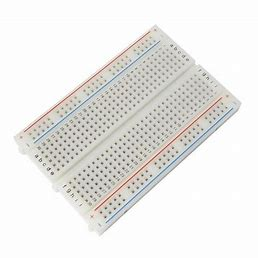

# Sistema IoT para Controle e Monitoramento Térmico em Estufas de Secagem de Motores Elétricos: Modelagem e Análise do protótipo


## Objetivo:  
  
Desenvolver um sistema de monitoramento baseado em Internet das Coisas (IoT) para o 
controle de estufa de secagem de motores elétricos. Esse sistema deverá obter de forma 
precisa os dados de temperatura em tempo real, mediante ajustes dinâmicos dos parâmetros  
de controle, garantido a eficiência operacional.  Esse sistema utilizará a plataforma de back
end FIWARE para processamento e armazenamento de informações contextuais, visando a 
otimização do processo de fabricação. A solução permitirá a regulação precisa da 
temperatura, monitoramento remoto em tempo real e aprimoramento da eficiência 
operacional, garantindo a produção de motores elétricos de alta qualidade e uniformidade 
em todas as unidades da empresa. O sistema será complementado por uma plataforma web 
desenvolvida em ASP.NET MVC, que dará suporte a cadastros e fornecerá visualização de 
dados em consultas e dashboards. 

## Descrição da Proposta:   
  
Em um contexto de produção global, uma empresa de motores elétricos enfrenta desafios 
significativos relacionados ao monitoramento em tempo real da temperatura nas estufas 
utilizadas para a secagem dos enrolamentos dos motores. Esse processo é crucial para 
assegurar a qualidade e durabilidade dos produtos, impactando diretamente a eficiência e 
a confiabilidade dos motores em aplicações industriais, comerciais e residenciais. 
A proposta deste projeto é criar um sistema de monitoramento IoT para um protótipo em 
escala reduzida de uma estufa de secagem. Este protótipo contará com uma resistência de 
aquecimento e sensores de temperatura, funcionando como um modelo para o 
desenvolvimento e teste de um sistema de controle e monitoramento térmico baseado em 
dispositivos IoT. Os testes serão realizados com base em condições reais de produção, 
proporcionando a oportunidade de desenvolver um sistema robusto e escalável antes de 
sua aplicação em larga escala em unidades industriais ao redor do mundo. 
O protótipo consiste em uma resistência de 6 Ohms com potência de 50W, utilizada para o 
aquecimento, acoplada a um dissipador de calor e a um sensor de temperatura LM35.

## Hardware

### Componentes
| **Componente**         | **Função**                                                                                                                | **Imagem** |
|-------------------------|---------------------------------------------------------------------------------------------------------------------------|------------|
| **Protoboard**          | Dispositivo utilizado para construir circuitos eletrônicos temporários sem solda, facilitando a experimentação.          |  |
| **ESP32**               | Conectividade e comunicação com a plataforma FIWARE, operando de 0V a 3,3V e suportando Wi-Fi e Bluetooth. LED embutido. |       |
| **10KΩ Resistor**       | Protege contra correntes excessivas e divide a tensão, garantindo leituras precisas de sinais analógicos.                |    |
| **Jumper Wires**        | Conecta fisicamente os componentes eletrônicos do sistema.                                                               |  |
| **Fonte DC**            | Fornece tensão contínua (DC) estável para alimentar circuitos eletrônicos.                                               |    |
| **Cabo de Força**       | Transmite energia elétrica de uma fonte para dispositivos eletrônicos ou equipamentos.                                   |  |
| **Cabos Banana**        | Conexões seguras em equipamentos eletrônicos, com conectores tipo banana.                                                |  |
| **Cabo USB**            | Permite comunicação e alimentação de dispositivos eletrônicos.                                                           |    |
| **Protótipo**           | Simula o funcionamento de uma estufa.                                                                                    |   |
| **Notebook**            | Equipamento utilizado para desenvolvimento e monitoramento do sistema.                                                   |    |

### Conexões
| **Componente** | **Conexão**                                              |
|----------------|----------------------------------------------------------|
| **ESP32**      |            |
| **Fonte DC**   |         |
| **Protótipo**  |       |

### Diagrama Elétrico
.

### Projeto Físico
.

## Software
### FIWARE
FIWARE é uma plataforma aberta que oferece ferramentas e APIs para o desenvolvimento de soluções inteligentes, facilitando a interoperabilidade entre sistemas, dispositivos IoT e aplicações. Seu principal componente, o Orion Context Broker, gerencia dados contextuais em tempo real, permitindo que dispositivos compartilhem informações. Neste caso, dados de temperatura são enviados ao FIWARE para tomada de decisões automatizadas. Os componentes da plataforma, conhecidos como Generic Enablers, são implantados via Docker, garantindo escalabilidade e portabilidade. APIs RESTful asseguram a comunicação entre os sistemas, enquanto o broker MQTT integra os dados do ESP32 ao FIWARE para processamento e análise em tempo real.

#### Diagrama em Camadas da Aplicação
.

### Código do ESP32
#### Dependências
Este projeto necessita das seguintes bibliotecas para funcionar:<br>
WiFi.h: Biblioteca para conexão Wi-Fi.<br>
PubSubClient.h: Biblioteca MQTT para Arduino.<br>
```cpp
#include <WiFi.h>
#include <PubSubClient.h>
```

#### Principais Parâmetros Configuráveis
O código permite personalizar várias informações para adaptá-lo a diferentes redes e plataformas. Aqui estão as principais variáveis configuráveis:
```cpp
// Configurações de Wi-Fi
const char* default_SSID = "POCO F5";       // Nome da rede Wi-Fi
const char* default_PASSWORD = "kanx5025"; // Senha da rede Wi-Fi

// Configurações do Broker MQTT
const char* default_BROKER_MQTT = "4.228.64.5"; // Endereço IP do broker
const int default_BROKER_PORT = 1883;          // Porta MQTT

// Configurações dos Tópicos MQTT
const String lamp = "03y"; 
const String mensagem_TOPICO_SUBSCRIBE = "/TEF/lamp" + lamp + "/cmd";  // Comandos
const String mensagem_TOPICO_PUBLISH_1 = "/TEF/lamp" + lamp + "/attrs"; // Estado do LED
const String mensagem_TOPICO_PUBLISH_2 = "/TEF/lamp" + lamp + "/attrs/t"; // Luminosidade

// GPIO do LED
const int default_D4 = 2; // Pino do LED onboard
```
#### Tópicos MQTT Utilizados
```/TEF/lamp03y/cmd```: Recebe comandos para ligar ou desligar o LED.<br>
Mensagem de Ligar: ```"lamp03y@on|"``` .<br>
Mensagem de Desligar: ```"lamp03y@off|"``` .<br>
```/TEF/lamp03y/attrs```: Publica o estado do LED (```"s|on"```  ou ```"s|off"``` ).<br>
```/TEF/lamp03y/attrs/t```: Publica a luminosidade lida do sensor.<br>

#### Configuração do Wi-Fi e Broker MQTT

O código tenta se conectar ao Wi-Fi e reconecta automaticamente caso a conexão caia. Após estabelecer a conexão, o ESP32 se conecta ao broker MQTT e configura tópicos de envio e escuta.
```cpp
void initWiFi() {
    Serial.println("Conectando ao Wi-Fi...");
    WiFi.begin(SSID, PASSWORD);
    while (WiFi.status() != WL_CONNECTED) {
        delay(500);
        Serial.print(".");
    }
    Serial.println("\nWi-Fi conectado!");
    Serial.print("IP: ");
    Serial.println(WiFi.localIP());
}

void initMQTT() {
    MQTT.setServer(BROKER_MQTT, BROKER_PORT);
    MQTT.setCallback(mqtt_callback);
    reconnectMQTT();
}
```
#### Reconexão Automática
Caso o ESP32 perca a conexão com o Wi-Fi ou o broker MQTT, ele tenta reconectar automaticamente.
```cpp
void VerificaConexoesWiFIEMQTT() {
    if (WiFi.status() != WL_CONNECTED) {
        reconectWiFi();
    }
    if (!MQTT.connected()) {
        reconnectMQTT();
    }
}
```

#### Controle do LED Onboard
As mensagens MQTT enviadas ao tópico de comando controlam o estado do LED onboard. O ESP32 responde ao comando ligando ou desligando o LED.
```cpp
void mqtt_callback(char* topic, byte* payload, unsigned int length) {
    String msg;
    for (int i = 0; i < length; i++) {
        msg += (char)payload[i];
    }
    if (msg == "lamp03y@on|") {
        digitalWrite(D4, HIGH);
        EstadoSaida = '1';
    } else if (msg == "lamp03y@off|") {
        digitalWrite(D4, LOW);
        EstadoSaida = '0';
    }
}
```

#### Leitura e Publicação de Temperatura
O código realiza uma leitura analógica do GPIO 34, simula valores de temperatura, e os publica no broker MQTT.
```cpp
void handleLuminosity() {
    const int potPin = 34;
    int sensorValue = analogRead(potPin);
    int luminosidade = map(sensorValue, 0, 4095, 0, 100);
    String mensagem = String(luminosidade);
    MQTT.publish(TOPICO_PUBLISH_2, mensagem.c_str());
    Serial.println("Luminosidade publicada: " + mensagem);
}
```
### Structured Query Language
#### Diagrama Conceitual


#### Diagrama Lógico


#### Criação do Banco de Dados
```sql
create database Termo_Light
go

use [Termo_Light]
go
```
#### Tabela ```empresa```
Armazena informações sobre as empresas, como nome, logo e sede.
```sql
create table empresa(
	id int identity(1,1) primary key not null,
	nome varchar(500) not null,
	logo varbinary(max) null,
	sede varchar(500) not null
)
go

insert into Empresa( nome, logo, sede) values ('Termo-Light', null, 'SP')
go
```
#### Tabela ```sensor```
Armazena informações sobre os sensores, com referência à empresa à qual pertencem.
```sql
create table sensor(
	id int identity(1,1) primary key not null,
	descricao varchar(500) null,
	fk_empresa_id int null,
	foreign key (fk_empresa_id) references Empresa(id) 
	on delete set null
)
go
```
#### Tabela ```acesso```
Armazena informações de acesso, incluindo nome de usuário, login, senha e a associação com a empresa.
```sql
create table acesso(
	id int identity(1,1) primary key not null,
	Nome_Usuario varchar(500) not null,
	login_Usuario varchar(500) not null,
	Senha varchar(500) not null,
	fk_empresa_id int not null,
	foreign key (fk_empresa_id) references Empresa(id)
	on delete cascade
)
go

insert into acesso (Nome_Usuario, login_usuario, senha, fk_empresa_id) values('SA','SA','123456',1)
go
```
#### Tabela ```funcionario```
Armazena informações sobre os funcionários, como nome, cargo, foto e data de contratação.
```sql
create table funcionario(
	id int identity(1,1) primary key not null,
	nome varchar(500) not null,
	cargo varchar(500) not null,
	foto varbinary(max) null,
	dataContratacao datetime not null
)
go
```
#### Tabela ```manutencao```
Armazena informações sobre a manutenção de sensores, incluindo a data, o funcionário responsável, o estado da manutenção, e referências aos sensores e funcionários envolvidos.
```sql
create table manutencao(
	id int identity(1,1) primary key not null,
	data_hora datetime not null,
	fk_sensor_id int not null,
	fk_funcionario_id int not null,
	estado int not null,
	foreign key ( fk_sensor_id) references Sensor(id)
		on delete cascade,
	foreign key (fk_funcionario_id) references Funcionario(id)
		on delete cascade
)
go
```

#### ```sp_delete_generic```
Essa stored procedure é usada para excluir uma linha de uma tabela genérica, com base no ID da linha e o nome da tabela. Ela monta dinamicamente uma instrução SQL para realizar a exclusão.
```sql
create or alter procedure sp_delete_generic(
	@id int,
	@tabela varchar(max)
)
as
begin
	declare @sql varchar (max)
	set @sql = ' delete ' + @tabela + ' where id = ' + cast(@id as varchar(max))
	exec (@sql)
end
```
#### ```sp_consulta_generic```
Retorna todos os dados de uma tabela específica para um determinado ID. A tabela e o ID são passados como parâmetros. Similar à ```sp_delete_generic```, a consulta é construída dinamicamente.
```sql
create or alter procedure sp_consulta_generic(
	@id int,
	@tabela varchar(max)
)
as
begin
	declare @sql varchar(max)
	set @sql = 'select * from ' + @tabela + ' where id = ' + CAST(@id as varchar(max))
	exec (@sql)
end
```
#### ```sp_listagem_generic```
Esta procedure retorna todas as linhas de uma tabela específica e permite a ordenação dos resultados através do parâmetro @ordem.
```sql
create or alter procedure sp_listagem_generic(
	@tabela varchar(max),
	@ordem varchar(max)
)
as
begin
	declare @sql varchar(max)
	set @sql = 'select * from ' + @tabela + ' order by ' + @ordem
	exec (@sql)
end
```
#### ```sp_insert_empresa```
Usada para inserir uma nova empresa na tabela Empresa, incluindo nome, logo e sede.
```sql
create or alter procedure sp_insert_empresa(
	@nome varchar(500),
	@logo varbinary(max),
	@sede varchar(500)
)
as
begin
	insert into Empresa (nome, logo, sede) values (@nome, @logo, @sede);
end
```

#### ```sp_update_empresa```
Atualiza os dados de uma empresa existente, identificada por ID.
```sql
create or alter procedure sp_update_empresa(
	@id int,
	@nome varchar(500),
	@logo varbinary(max),
	@sede varchar(500)
)
as
begin
	update Empresa set nome = @nome, logo = @logo, sede = @sede
	where id = @id
end
```
#### ```sp_busca_id_empresa```
Busca o ID de uma empresa pelo nome.
```sql
create or alter procedure sp_busca_id_empresa(
	@nome varchar(500)
)
as
begin
	select id from Empresa where nome = @nome
end
```
#### ```sp_insert_sensor```
Insere um novo sensor na tabela Sensor, associando-o a uma empresa via fk_empresa_id.
```sql
create or alter procedure sp_insert_sensor(
	@descricao varchar(500),
	@fk_empresa_id int
)
as
begin
	insert into Sensor(descricao, fk_empresa_id) values (@descricao, @fk_empresa_id)
end
```
#### ```sp_update_sensor```
Atualiza os dados de um sensor específico, identificado por ID.
```sql
create or alter procedure sp_update_sensor(
	@id int,
	@descricao varchar(500),
	@fk_empresa_id int
)
as
begin
	update Sensor set descricao = @descricao, fk_empresa_id =@fk_empresa_id where id = @id
end
```
#### ```sp_verificar_sensor```
Verifica se existe um sensor com a descrição fornecida. Retorna a contagem de registros.
```sql
create or alter procedure sp_verificar_sensor(
	@descricao varchar(max)
)
as
begin
	select COUNT(descricao) as cont from sensor where descricao = @descricao
end
```
#### ```sp_avancado_sensor```
Permite uma busca avançada de sensores, filtrando por descricao e empresa, com um parâmetro de tipo (```@tipo```).
```sql
create or alter procedure sp_avancado_sensor(
	@descricao varchar(max),
	@empresa varchar(max),
	@tipo bit
)
as
begin
	declare @likeDescricao varchar(max)
	set @likeDescricao = '%' + @descricao + '%'
	declare @likeEmpresa varchar(max)
	set @likeEmpresa = '%' + @empresa + '%'

	select s.id, descricao, fk_empresa_id 
	from sensor as s
	inner join empresa as e
	on e.id = s.fk_empresa_id
	where s.descricao like @likeDescricao and
	( (@tipo = 0 and e.nome like @likeDescricao) or (@tipo = 1 and e.nome = @empresa))
end
```
#### ```sp_insert_acesso```
Insere um novo acesso de usuário na tabela ```Acesso```.
```sql
create or alter procedure sp_insert_acesso(
	@senha varchar(500),
	@Nome_Usuario varchar(500),
	@login_Usuario varchar(500),
	@fk_empresa_id int
)
as
begin
	insert into Acesso(Nome_Usuario, senha, fk_empresa_id) values (@Nome_Usuario, @senha, @fk_empresa_id)
end
```
#### ```sp_login_acesso```
Recupera todos os acessos de uma empresa, utilizado para fazer login.
```sql
create or alter procedure sp_login_acesso(
	@id_empresa int
)
as
begin
	select * 
	from Acesso as a 
	inner join Empresa as e on e.id = a.fk_empresa_id 
	where e.id = @id_empresa
end
```
#### ```sp_update_acesso```
Atualiza os dados de acesso de um usuário, como nome, login, senha e a empresa associada.
```sql
create or alter procedure sp_update_acesso(
	@id int,
	@Nome_Usuario varchar(500),
	@login_Usuario varchar(500),
	@senha varchar(500),
	@idEmpresa int
)
as
begin
	update acesso set Nome_Usuario = @Nome_Usuario, fk_empresa_id = @idEmpresa, senha = @senha, @login_Usuario = @login_Usuario where id = @id
end
```
#### ```sp_insert_funcionario```
Insere um novo funcionário na tabela ```Funcionario```.
```sql
create or alter procedure sp_insert_funcionario(
	@nome varchar(500),
	@cargo varchar(500),
	@foto varbinary(max),
	@dataContratacao datetime
)
as
begin
	insert into Funcionario (nome, Cargo, Foto, dataContratacao) values (@nome, @cargo, @foto, @dataContratacao)
end
```
#### ```sp_update_funcionario```
Atualiza os dados de um funcionário, identificando-o por ID.
```sql
create or alter procedure sp_update_funcionario(
	@id int,
	@nome varchar(500),
	@cargo varchar(500),
	@foto varbinary(max),
	@dataContratacao datetime
)
as
begin
	update Funcionario set nome = @nome, cargo = @cargo, Foto = @foto, dataContratacao = @dataContratacao where id = @id 
end
```
#### ```sp_insert_manutencao```
Insere um novo registro de manutenção, associando a data, o sensor e o funcionário.
```sql
create or alter procedure sp_insert_manutencao(
	@data_hora datetime,
	@fk_sensor_id int,
	@fk_funcionario_id int,
	@estado int
)
as
begin
	insert into Manutencao(data_hora, fk_sensor_id, fk_funcionario_id, estado) 
	values (@data_hora, @fk_sensor_id, @fk_funcionario_id, @estado)
end
```
#### ```sp_update_manutencao```
Atualiza o registro de manutenção existente com base no ID.
```sql
create or alter procedure sp_update_manutencao(
	@id int,
	@data_hora datetime,
	@fk_sensor_id int,
	@fk_funcionario_id int,
	@estado int
)
as
begin
	update manutencao set data_hora = @data_hora, fk_funcionario_id = @fk_funcionario_id, fk_sensor_id = @fk_sensor_id, estado = @estado where id = @id
end
```
#### ```sp_avancado_manutencao```
Executa uma busca avançada nos registros de manutenção, permitindo filtrar por data, funcionário, empresa, sensor e estado.
```sql
create or alter procedure sp_avancado_manutencao(
	@data_hora_inicial datetime,
	@data_hora_final datetime,
	@funcionario varchar(max),
	@empresa varchar(max),
	@sensor varchar(max),
	@estado int
)
as
begin
	set @funcionario = '%' + @funcionario + '%'
	set @empresa = '%' + @empresa + '%'
	set @sensor = '%' + @sensor + '%'

	select m.id, m.fk_funcionario_id, m.fk_sensor_id, m.data_hora, m.estado
	from manutencao as m
	inner join sensor as s on s.id = m.fk_sensor_id
	inner join funcionario as f on f.id = m.fk_funcionario_id
	inner join empresa as e on e.id = s.fk_empresa_id
	where m.data_hora >= @data_hora_inicial and m.data_hora <= @data_hora_final
	and e.nome like @empresa and s.descricao like @sensor and f.nome like @funcionario
	and ((estado = @estado and @estado !=4) or (@estado = 4))
end
```
### Site
#### *Models*
Este projeto define uma série de modelos para a aplicação SitePBL. Esses modelos representam as entidades do sistema e são organizados para facilitar a integração
e o uso nas camadas de apresentação e controle.<br>

1. **PadrãoViewModel**: Classe abstrata base para outras ViewModels. <br>
* Propriedade: ```int? id``` Identificador genérico.<br>

2. **AcessoViewModel**: Representa as credenciais de acesso de usuários ao sistema. <br>
* Herança: PadraoViewModel <br>
* Propriedades: <br>
```string senha``` Senha do usuário <br>
```int empresaId``` Identificador da empresa associada <br>
```string nomeEmpresa``` Nome da empresa associada <br>
```string loginUsuario``` Login do usuário <br>
```string nomeUsuario``` Nome do usuário <br>

3. **ManutencaoViewModel**: Armazena informações sobre manutenções.
* Herança: PadraoViewModel <br>
* Propriedades: <br>
```DateTime data_hora``` Data e hora da manutenção.
```int idSensor``` Identificador do sensor relacionado.
```string? descricaoSensor``` Descrição do sensor.
```int idFuncionario``` Identificador do funcionário responsável.
```string? nomeFuncionario``` Nome do funcionario responsável.
```int estadoId``` Estado da manutenção (feito, em andamento, etc).
```string? estadoNome```Nome do estado.
```string? nomeEmpresa``` Nome da empresa associada.

4. **SensorViewModel**: Representa informações sobre os sensores do sistema.<br>
* Herança: PadraoViewModel <br>
* Propriedades: <br>
```string descricao``` Descrição ou identificador do sensor no Fiware.<br>
```int empresaId``` Identificador da empresa associada.<br>
```string? empresaNome``` Nome da empresa associada.<br>

5. **FotoPadraoViewModel**: Classe abstrata que adiciona suporte para manipulação de imagens.<br>
* Herança: PadraoViewModel <br>
* Propriedades: <br>
```IFormFile? imagem``` Arquivo da imagem.
```byte[]? imagembyte``` Representação da imagem em bytes.
```string? foto64``` Imagem em formato Base64. somenta leitura.
* Método:<br>
```byte[] ConvertImageToByte(IFormFile file)``` Converte uma imagem em formato ```IFormFile``` para bytes.<br>

6. **FuncionarioViewModel**: Representa as informações sobre os funcionarios da empresa.<br>
* Herança: FotoPadraoViewModel <br>
* Propriedades: <br>
```string nome``` Nome do funcionário.
```string cargo``` Cargo do funcionário.
```DateTime dataContratacao``` Data de contratação do funcionário.

7. **EmpresaViewModel**: Representa as informações sobre as empresas cadastradas.<br>
* Herança: FotoPadraoViewModel <br>
* Propriedades: <br>
```string nome``` Nome da empresa<br>
```string sede```Localização da sede da empresa<br>

8. **LeituraViewModel**: Representa uma leitura do sensor.<br>
* Propriedades: <br>
```float temperatura``` Temperatura registrada (somente leitura).<br>
```DateTime data``` Data e hora da leitura (somente leitura).<br>
* Constructor: <br>
Exige ```float temperatura``` e ```DateTime data```.<br>

9. **ErrorViewModel**: Modelo para representação de erros do sistema.<br>
* Propriedades: <br>
```string Erro``` Mensagem de erro.<br>
```string? RequestId``` Identificador da requisição.<br>
```bool ShowRequestId``` Indica se o RequestID está disponível. <br>
* Construtores: <br>
```ErrorViewModel(string erro)``` Inicializa com uma mensagem de erro.<br>
```ErrorViewModel()``` Inicializa sem mensagem.<br>

#### *DAO*
Este documento descreve as classes e utilitários relacionados à camada de acesso a dados (DAO) do projeto SitePBL. 
Essa camada é responsável por abstrair a comunicação com o banco de dados, incluindo a execução de Stored Procedures (SPs), consultas e manipulações de registros. <br>

1. **PadraoDAO<T>**: Classe abstrata genérica que serve como base para outras DAOs. Ela define métodos comuns para operações no banco de dados.<br>


## Youtube
[Video pitch](link_do_video).
<br>

## Manual
1. Preparação do Ambiente
* Configure uma rede Wi-Fi para o ESP32 e um broker MQTT.
* Substitua os valores padrão (SSID, senha, IP do broker) pelas suas informações.
2. Carregamento do Código
* Utilize o Arduino IDE ou outro ambiente compatível para carregar o código no ESP32.
3. Monitoramento e Controle
* Use o monitor serial para acompanhar logs de conexão e status.
* Publique mensagens no broker MQTT para enviar comandos e visualize os dados de temperatura.


## Referências Bibliográficas
CABRINI, Fabio. fiware. GitHub, n.d. Disponível em: https://github.com/fabiocabrini/fiware. Acesso em: 16 de out. de 2024. <br>
LUCAS-O-S. DataLogger-V2. 2024. Disponível em: https://github.com/Lucas-O-S/DataLogger-V2. Acesso em: 16 nov. 2024.
SANLIM, Alexandre. Badges4-README.md-Profile. 2021. GitHub. Disponível em: https://github.com/alexandresanlim/Badges4-README.md-Profile. Acesso em: 16 de nov de 2024.<br>

